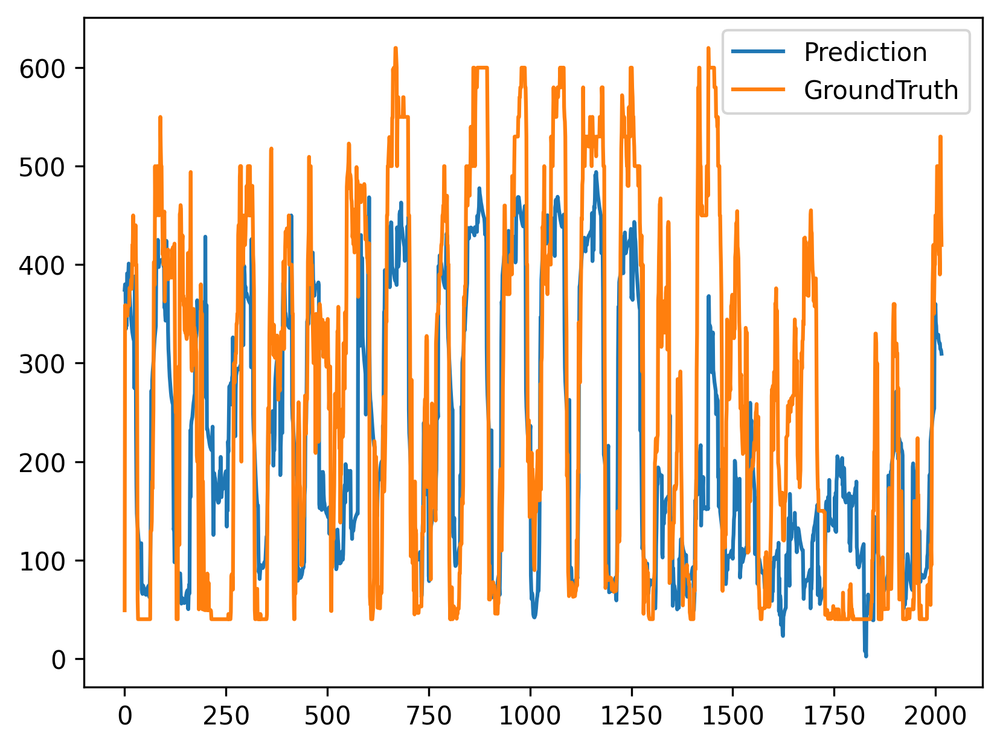

# Electricity-Market-Price-Forecasting
This repository is for the electricity forecasting via deep learning methods
## Overview
This project aims to develop a robust forecasting model for electricity market prices using advanced machine learning techniques. By leveraging historical price data, the model predicts future electricity prices, assisting stakeholders in making informed decisions.
## Table of Contents
- Insatllation
- Usage
- Data
- Model Architecture
- Results
## Installation
To set up the project, install python=3.8, clone the repository and install the required dependencies:
```bash
git clone https://github.com/hejinhua1/Electricity-Market-Price-Forecasting.git
cd Electricity-Market-Price-Forecasting
pip install -r requirements.txt
```

Please note that the project is built using PyTorch, and the required CUDA version is 12.4. You can install it using the following command:
```bash
conda install pytorch torchvision torchaudio pytorch-cuda=12.4 -c pytorch -c nvidia
```

## Usage
We have provided scripts for training and evaluating the models for selected. As for now, we have implemented the following models:
- TimesNet
- TimeXer
- Informer
- Autoformer
- Nonstationary_Transformer

To train the above models respectively, run the following command:
```bash
bash ./scripts/long_term_forecast/ElcPrice_script/TimesNet_ElcPrice.sh
bash ./scripts/long_term_forecast/ElcPrice_script/TimeXer_ElcPrice.sh
bash ./scripts/long_term_forecast/ElcPrice_script/Informer_ElcPrice.sh
bash ./scripts/long_term_forecast/ElcPrice_script/Autoformer_ElcPrice.sh
bash ./scripts/long_term_forecast/ElcPrice_script/Nonstationary_Transformer_ElcPrice.sh
```
After training, you can get the evaluation results in the 'test_results' and 'results' folder. And the trained models are saved in the 'checkpoints' folder.

## Data
The dataset used in this project is the real-world electricity market price data from GanShu Province, China. The dataset contains 15-min electricity prices in 2024.
The label column is the electricity price, namely 'dayahead_clearing_price', and the columns 'wind_power_forecast', 'photovoltaic_power_forecast' and 'realtime_clearing_price' 
are not used.
For the data preprocessing, we have implemented the following steps:
- Data in the full_data.feather file is cleaned and preprocessed.
- In the model, we have added the temporal features, such as the hour of the day, day of the week, and month of the year.

For the model parameters, you should modify the following parameters in the config file:
- data_path: the path to the data file
- model_name: the name of the model
- seq_len: historical sequence length 
- pred_len: prediction length
- enc_in: the raw number of input features, default is 8
- dec_in: the raw number of output features, default is 8
- c_out: the number of output features, default is 8, but you can set up the 'feature' parameter in the config file to select the feature you want to predict
- feature: the feature you want to predict, default is 'MS', meaning just predict the electricity price
## Model Architecture
TODO: Add model architecture diagram
## Results
The visualization of the results is shown in the 'test results' folder. [Here](test_results/long_term_forecast_ElcPrice_96_96_Informer_ElcPrice_ftMS_sl96_ll48_pl96_dm512_nh8_el2_dl1_df2048_expand2_dc4_fc3_ebtimeF_dtTrue_Exp_16_0/0.pdf), we have provided the results of the TimesNet model.
For now, the best model is the Informer model, which achieves the lowest RMSE and MAE. The results of the TimesNet model are shown below:

```bash
long_term_forecast_ElcPrice_96_96_Informer_ElcPrice_ftMS_sl96_ll48_pl96_dm512_nh8_el2_dl1_df2048_expand2_dc4_fc3_ebtimeF_dtTrue_Exp_16_0  
mse:20175.2734, mae:110.7404, rmse:142.0397, mape:0.7177, mspe:1.4207, dtw:not calculated
```
The results of the Informer model are shown below:



